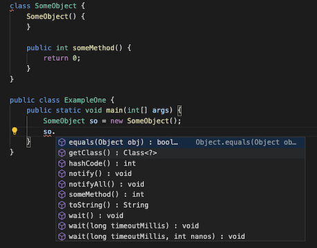

# java-autocomplete

## Intro

For this project I decided to focus on the two parts of code completion programs that I find myself using the most: method suggestions and constructor parameter options.

## Installation and Examples

Assuming node is already installed (built with node v12.18.0).
From the root directory:

```sh
npm install
npm start <path-to-file> <index>
```

### Custom Method Suggestion



```sh
npm start examples/ExampleOne.java 223
```

Output:

```sh
----------------------------------------------------------------------------------------------------
someMethod( )                                       | return type:  int
getClass( )                                         | return type:  Class
hashCode( )                                         | return type:  int
equals( Object obj )                                | return type:  boolean
toString( )                                         | return type:  String
notify( )                                           | return type:
notifyAll( )                                        | return type:
wait( )                                             | return type:  InterruptedException
wait( long timeoutMillis )                          | return type:  long
wait( long timeoutMillis , int nanos )              | return type:  long
----------------------------------------------------------------------------------------------------
```

### Constructor Parameter Suggestions


```sh
npm start examples/ExampleTwo.java 237
```

Output:

```sh
----------------------------------------------------------------------------------------------------
String( )
String( String original )
String( StringBuffer buffer )
String( StringBuilder builder )
String( char value[] )
String( char value[] , int offset , int count )
String( char[] value , int off , int len , Void sig )
String( int[] codePoints , int offset , int count )
String( byte ascii[] , int hibyte , int offset , int count )
String( byte ascii[] , int hibyte )
String( byte bytes[] , int offset , int length , String charsetName )
String( byte bytes[] , int offset , int length , Charset charset )
String( byte bytes[] , int offset , int length )
String( byte bytes[] , String charsetName )
String( byte bytes[] , Charset charset )
String( byte[] bytes )
String( byte[] value , byte coder )
String( AbstractStringBuilder asb , Void sig )
----------------------------------------------------------------------------------------------------
```

### Partial Method Suggestions


```sh
npm start examples/ExampleThree.java 258
```

Output:

```sh
substring( int beginIndex )                         | return type:  int
substring( int beginIndex , int endIndex )          | return type:  int
subSequence( int beginIndex , int endIndex )        | return type:  int
```

## Process

This program begins by loading in the Java standard classes. For the purposes of this project, I've just copied three in (Integer, Object, and String), but in the future the complete library could be pulled in from the host machine. For each file, java-autocomplete uses tree-sitter to identify the public classes (in order to simplify things I ignored more nuanced scope considerations in many places) and add them to a search-trie. Then within those classes, public, non-static methods are added to their own class-specific search trie (again to minimize the scope I did not process public variables). Finally, all public constructors are also added to a class-specific search trie. To maintain all of these tries, I created my own data structure to map each trie to a relevant key.
Once the standard libraries are processed, java-autocomplete processes the input file in the same way. Then the program uses tree-sitter to find the closest relevant node to the given index, falling into one of two categories: method or constructor suggestions. If no relevant node is found the program exits. The mapping of tries can now be used to efficiently find the relevant methods or constructors.
